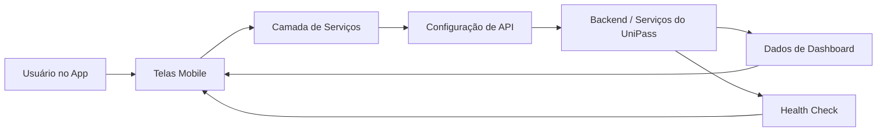
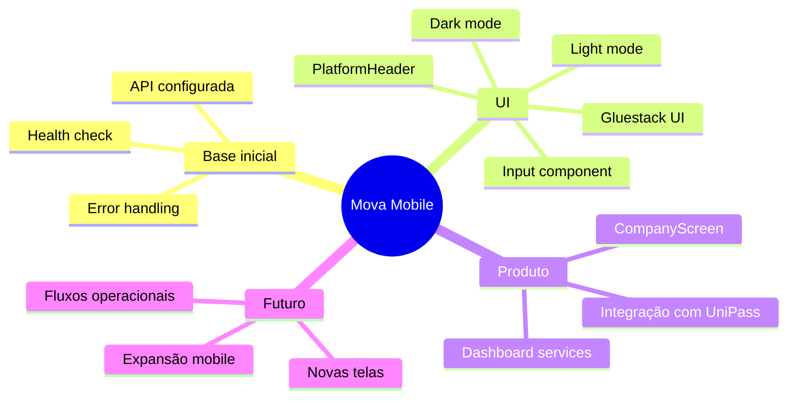

# Mova Mobile

Aplicativo mobile do ecossistema `UniPass`, criado para levar a experiência da plataforma para o dia a dia operacional em uma interface mais prática, acessível e preparada para evolução.

> O Mova Mobile representa o próximo passo do UniPass: sair do painel web e expandir a operação para uma experiência mobile mais fluida e conectada.

## Visão Geral

O `Mova Mobile` nasce como a extensão mobile do UniPass, com foco em consumo de dados da plataforma, organização de telas essenciais e construção de uma base sólida para crescimento do produto. A proposta é permitir que a operação também aconteça no celular, com uma experiência mais direta, moderna e pronta para integração com os serviços centrais do sistema.

Pelo histórico de commits, o projeto já começou com uma fundação bem definida: configuração de API com tratamento de erro, health check, provider de interface com suporte a tema claro e escuro, componentes reutilizáveis e integração inicial com serviços de dashboard.

## Relação com o UniPass

| Plataforma    | Papel                                                                   |
| ------------- | ----------------------------------------------------------------------- |
| `UniPass Web` | Gestão, rastreamento e visão operacional centralizada                   |
| `Mova Mobile` | Expansão da experiência para uso mobile e acompanhamento mais acessível |

## Objetivo do Projeto

O objetivo do Mova Mobile é transformar a base do UniPass em uma experiência móvel preparada para:

- ampliar o acesso à operação no dia a dia;
- facilitar o consumo de informações em contexto mobile;
- criar uma base consistente para novas telas e fluxos;
- manter integração com os serviços centrais da plataforma;
- evoluir com foco em usabilidade, estabilidade e escala.

## Principais Entregas Iniciais

- Estrutura inicial do aplicativo.
- Configuração de API centralizada.
- Implementação de health check para validação de comunicação com backend.
- Tratamento de erros na camada de integração.
- Provider de interface com suporte a light mode e dark mode.
- Criação de componentes reutilizáveis para a base visual.
- Adição de assets de logo.
- Implementação de componente de input.
- Criação de `PlatformHeader`.
- Criação de `CompanyScreen`.
- Integração inicial com serviços de dashboard.

## Evolução do Desenvolvimento

## Estrutura Conceitual

| Camada                | Responsabilidade                                       |
| --------------------- | ------------------------------------------------------ |
| Interface mobile      | Exibir telas, componentes e fluxo de navegação         |
| Design system base    | Garantir consistência visual e suporte a temas         |
| Integração com API    | Consumir dados e conectar o app ao ecossistema UniPass |
| Tratamento de erros   | Proteger a experiência contra falhas de comunicação    |
| Serviços de dashboard | Reaproveitar dados estratégicos do sistema principal   |

## Componentes e Base Visual

| Elemento              | Função                                                |
| --------------------- | ----------------------------------------------------- |
| `PlatformHeader`      | Padronizar a apresentação superior das telas          |
| `CompanyScreen`       | Estruturar uma das telas iniciais do produto          |
| `Input`               | Reutilização de entrada de dados com base consistente |
| Logos e assets        | Reforçar identidade visual do app                     |
| Gluestack UI Provider | Sustentar componentes e temas globais                 |

## Fluxo de Integração

## Base de Evolução do Produto

## Diferenciais do Projeto

- Faz parte de um ecossistema maior, e não de um app isolado.
- Já nasce conectado à visão de produto do UniPass.
- Foi iniciado com preocupação real com estabilidade de integração.
- Possui base visual preparada para tema claro e escuro.
- Estrutura componentes reutilizáveis desde o começo.
- Cria terreno para evolução consistente do app.

## Roadmap Sugerido

| Status        | Frente             | Próximo avanço esperado                             |
| ------------- | ------------------ | --------------------------------------------------- |
| Concluído     | Base do app        | Estrutura inicial pronta para expansão              |
| Concluído     | Integração técnica | API, health check e tratamento de erro configurados |
| Concluído     | Base visual        | Provider de UI, logos e componentes iniciais        |
| Em evolução   | Telas do produto   | Expansão de novas screens e fluxos                  |
| Em evolução   | Dashboard mobile   | Ampliar consumo e visualização dos dados            |
| Próximo passo | Operação mobile    | Levar mais ações reais do UniPass para o app        |

## Tecnologias e Recursos Identificados

| Recurso         | Uso no projeto                            |
| --------------- | ----------------------------------------- |
| Gluestack UI    | Base de interface e suporte a temas       |
| API services    | Comunicação com os serviços da plataforma |
| Health check    | Validação de disponibilidade e conexão    |
| Assets visuais  | Identidade e consistência visual          |
| Componentização | Organização e reutilização da interface   |

## Próximos Passos

- expandir o número de telas;
- aprofundar o consumo de dados do dashboard;
- criar fluxos operacionais nativos para mobile;
- fortalecer autenticação e contexto de sessão;
- refinar a experiência visual e a navegação.

## Conclusão

O `Mova Mobile` é o início da camada mobile do UniPass. Mesmo nas primeiras entregas, já mostra uma direção clara: criar um aplicativo consistente, integrado à plataforma principal e preparado para crescer com foco em operação real, experiência de uso e evolução contínua do produto.
